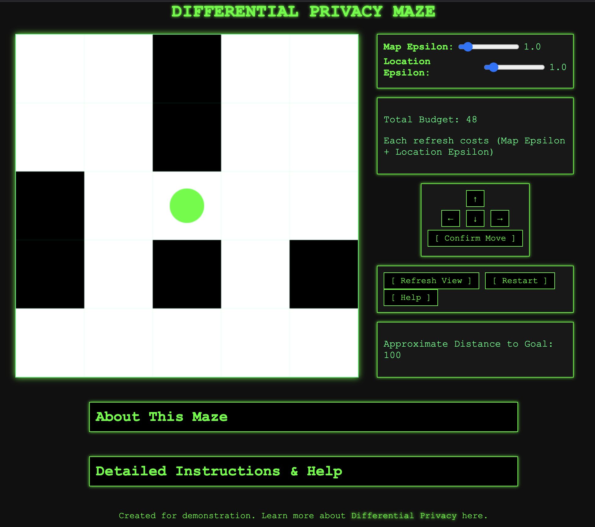

# Differential Privacy Maze [Work in progress]

This project demonstrates a concept of navigating a maze under the constraints of differential privacy (DP). The maze is large (50x50 cells), but the player can only see a 5x5 local area around their current position. When the player refreshes their view, noise is introduced to the local map based on a chosen *epsilon* (privacy budget) parameter. Lower epsilon means more distortion (less clarity), and higher epsilon means clearer but less private information.

## Features

- **Limited Visibility:**  
  Only a 5x5 area around the player is shown at any time.
  
- **Differential Privacy Noise:**  
  Adjust the epsilon parameter to control how much noise (inaccuracy) is added to the local view.
  
- **Privacy Budget:**  
  The player starts with a total budget of 50 units. Each time they refresh the view, the current epsilon value is subtracted from the total budget. If the budget reaches 0, the player can no longer refresh their view.
  
- **Move Confirmation:**  
  The player proposes moves with arrow buttons, and must confirm the move before their position updates. This simulates uncertainty and the need to carefully decide on actions based on the noisy information.

- **Win Condition:**  
  The goal is to reach the bottom-right cell of the maze (49,49).

## Controls

- **Epsilon Slider:** Adjust the epsilon value (0.1 to 10).  
- **Refresh View:** Apply DP noise and reveal the local 5x5 area. Costs `epsilon` from total budget.  
- **Arrow Buttons:** Propose a move (up, down, left, right).  
- **Confirm Move:** Finalize the proposed move if it's valid (not blocked by a wall).  
- **Restart:** Reset the maze, player position, and budget.

## Running the Project
It won't run until I fix it xD
